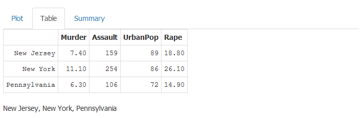
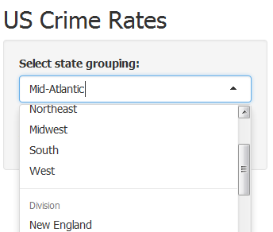
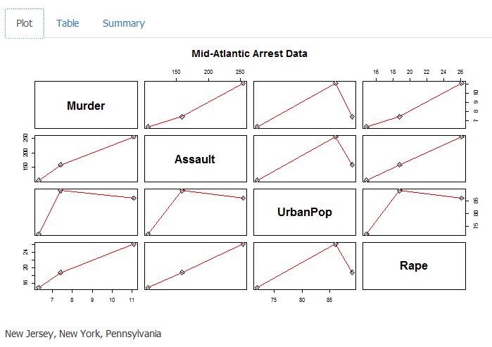

Exploring The USArrests Dataset
========================================================
author: John Sinues
date:   February 22, 2015
transition:  fade

Introduction
========================================================
Develop a [shinyapps.io] (http://shiny.rstudio.com/articles/shinyapps.html)
app that allows a user to explore the USArrests dataset.
The US Arrest dataset contains statistics, in 
arrests per 100,000 residents for assault, murder, and 
rape in each of the 50 US states in 1973.

Enhance the dataset by grouping the states into [regions and 
divisions] (http://en.wikipedia.org/wiki/List_of_regions_of_the_United_States#Official_regions_of_the_United_States) 
which may give greater insight on the data. 

Tab highlights
========================================================
Results are displayed in three tabs.  

* The _plot tab_ displays a scatterplot matrix which is good 
for determining rough linear correlations of metadata 
that contain continuous variables.
* The _table tab_ contains the data used in the analysis.
* The _summary tab_ contains summary statistics for selected
states.

Slide With Plots
========================================================
Compare arrest statistics from different regions and
divisions.

 

***
This example displays the Mid-Atlantic and South-Atlantic regions.

 

Summary
========================================================
This Shiny app explores the USArrests dataset by utilizing
a basic control for filtering the US states by regions and divisions.

***
After selecting a filter, the results are presented
in a tabbed layout featuring a scatter plot, a table
of data, and summary statistics.

